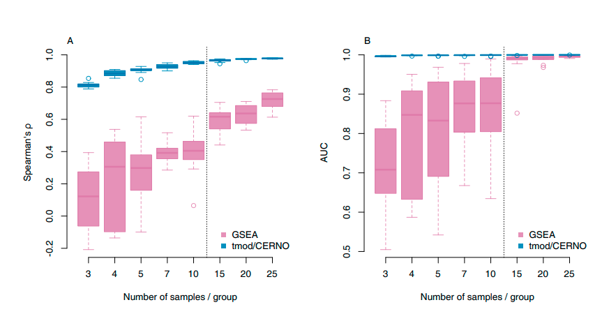

```{r,echo=FALSE}
## Set default options for the knitr RMD processing
knitr::opts_chunk$set(echo=FALSE,warning=FALSE,message=FALSE,fig.width=5,fig.height=5,cache=TRUE,autodep=TRUE, results="hide")
```

```{r libraries,cache=FALSE}
library(DESeq2)
library(tmod)
source("functions.R")
```

```{r}
set.seed(1234)
n <- 10
totN <- 50

ex1 <- rep(0, totN)
sel <- sort(sample(1:totN, n, prob=((totN:1)/totN)^7))
ex1[sel] <- 1
ex2 <- rep(0, totN)
ex2[ sample(1:totN, n) ] <- 1
```


```{r}
counts <- as.matrix(read.table("Data/covid_data/counts.tsv"))
annot  <- read.csv("Data/covid_data/annotation.all.csv")
covar  <- read.table("Data/covid_data/covariate_file.txt", sep="\t", header=T)

ds <- DESeqDataSetFromMatrix(countData=counts, 
  colData=covar, design=~ 0 + group)

ds <- DESeq(ds)
res <- results(ds, contrast=c("group", "A549.RSV", "A549.mock"))
res <- merge(annot, data.frame(res), by.x="PrimaryID", by.y=0)
```

## Why do we need functional data analysis?

```{r results="markdown"}
res <- res[ order(res$pvalue), ]
tmp <- head(res[ order(res$pvalue), ], 20)
tmp <- tmp[ , c("SYMBOL", "GENENAME", "log2FoldChange", "padj") ]
tmp$log2FoldChange <- format(tmp$log2FoldChange, digits=2)
tmp$padj <- format.pval(tmp$padj, digits=2)
colnames(tmp) <- c("Symbol", "Description", "log(FC)", "q")
tmp
```

## Simple idea

 * Group genes by some property (for example, interferon inducible genes)
 * Look at the group as a whole

# Getting gene sets

## Overview

|Source| |
|-------|--------|
|GO (Gene ontology)|Very general, quite detailed; many gene sets unfortunately useless; suitable also for other organisms|
|KEGG|Database of pathways from the Kyoto Encyclopaedia of Genes and Genomes|
|PID|Pathway Interaction Database (National Cancer Institute + Nature Publishing Group)|
|Reactome|Free online database|
|MSigDB|Meta-database, contains many sets of gene sets|
|tmod|Genes clustered by expression in human WBC|

<br>
<br>

There are many others (WikiPathways, BioCarta, BioCyc, MetaCyc,
ConsensusPathDB). It is worth checking them out when looking for a
particular pathway or gene set, or in a particular context.

It is also possible to use your own gene sets.

## MSigDB

MSigDB gene sets are divided into categories and sub-categories

|Category              |Subcategory|Description |
|----------------------|------------|------------|
|H (Hallmark)          | |50 hand-picked particularly well described gene sets|
|C1 (positional gene sets)| |Chromosome gene sets|
|C2 (curated gene sets)|  | |
|                      |CGP (chemical perturbations)|Transcriptional responses to different compounds (literature based)|
|   |KEGG|KEGG pathways|
|   |BIOCARTA|BioCarta pathways|
|   |REACTOME|Reactome pathways|
|   |PID|Pathway Interaction Database pathways|
|C3 (regulatory targets)| |e.g. miRNA targets (several subcategories)|
|C3 (regulatory targets)| |e.g. miRNA targets (several subcategories)|
|C4 ("computational GS")|CGN, CM |Cancer gene sets|
|C5 (GO)| BP, CC, MF|Gene ontology sets (filtered)|
|C6 (oncogenic signatures)||Cancer (literature based)|
|C7 (immunologic signatures)||Immune responses (literature based)|

## MSigDB from R package

```{r echo=TRUE,results="markdown"}
library(msigdbr)
h <- msigdbr("Homo sapiens", "H")
nrow(h)
head(h)
```

## MSigDB directly (using tmod)

Download the file `msigdb_v7.1.xml` from
[https://www.gsea-msigdb.org/gsea/downloads.jsp](https://www.gsea-msigdb.org/gsea/downloads.jsp) (176 MB).

```{r echo=TRUE,results="markdown"}
library(tmod)
msig <- tmodImportMSigDB("msigdb_v7.1.xml")
msig
head(msig$MODULES)
```

## tmod gene expression modules

```{r echo=TRUE,results="markdown"}
data(tmod)
tmod
head(tmod$MODULES)
```

## tmod object

Tmod object is a list with two mandatory elements:

 * `MODULES`: data frame describing the gene sets
 * `MODULES2GENES`: list mapping modules to genes

```{r echo=TRUE,results="markdown"}
head(msig$MODULES[ msig$MODULES$Category == "H", ])
msig$MODULES2GENES[["M5944"]]
```


# 1st generation algorithms

## 1st generation

<div class="columns-2">

```{r,fig.width=5,fig.height=5}
two_col_example(NULL, NULL, n=length(ex))
```

## 1st generation

<div class="columns-2">

```{r,fig.width=5,fig.height=5}
two_col_example(NULL, ex2)
```

## 1st generation

<div class="columns-2">

```{r,fig.width=5,fig.height=5}
two_col_example(ex1, ex2)
```


## 1st generation

<div class="columns-2">

```{r,fig.width=5,fig.height=5}
two_col_example(ex1, ex2)
abline(h=7, col="#0081DD", lwd=2)
text(2.6, 7, "P-Value threshold", pos=3)
```


## 1st generation

<div class="columns-2">

```{r,fig.width=5,fig.height=5}
two_col_example(ex1, ex2)
abline(h=7, col="#0081DD", lwd=2)
text(2.6, 7, "P-Value threshold", pos=3)
```


```{r}
n1 <- 6
b1 <- sum(ex1[1:n1] == 1)
B1 <- sum(ex1 == 1)
N1 <- length(ex1)

n2 <- 6
b2 <- sum(ex2[1:n1] == 1)
B2 <- sum(ex2 == 1)
N2 <- length(ex2)
```

Enriched (left):

|              |In gene set          |Total                           |
|--------------|---------------------|--------------------------------|
|Significant   |`r b1`               |`r n1`                          |
|Total         |`r B1`               |`r N1`                          |

<br>

Not enriched (right):

|              |In gene set          |Total                           |
|--------------|---------------------|--------------------------------|
|Significant   |`r b2`               |`r n2`                          |
|Total         |`r B2`               |`r N2`                          |


</div>

## Possible tests

 * $\chi^2$ test: `chisq.test()`
 * Fisher's exact test: `fisher.test()`
 * hypergeometric test: `phyper()`

## $\chi^2$ test

 * b: number of genes significant and in gene set 
 * n: total number of significant genes
 * B: total number of genes in gene set
 * N: total number of genes

Contingency table:

|       |In gene set     |Not in gene set     |
|--------|-----------------|---------------|
|significant  |$b$           |$n - b$|
|not significant|$B - b$    |$(N-n) - (B-b)$|

## Contingency tables

Easier method of getting the contingency table is using the `table`
function.

```{r echo=TRUE,results="markdown"}
ex1 # example 1: enriched
## we define first six genes to be significant
sign <- c(rep(TRUE, 6), rep(FALSE, length(ex1) - 6))
sign
table(ex1, sign)
```


## $\chi^2$ test: Enriched


 * b: number of genes significant and in gene set 
 * n: total number of significant genes
 * B: total number of genes in gene set
 * N: total number of genes

```{r echo=TRUE,results="markdown"}
ct1 <- matrix(c(b1, n1-b1, B1-b1, (N1-n1)-(B1-b1)), nrow=2)
ct1
chisq.test(ct1)
```


## $\chi^2$ test: Not enriched

 * b: number of genes significant and in gene set 
 * n: total number of significant genes
 * B: total number of genes in gene set
 * N: total number of genes

```{r echo=TRUE,results="markdown"}
ct2 <- matrix(c(b2, n2-b2, B2-b2, (N2-n2)-(B2-b2)), nrow=2)
chisq.test(ct2)
```

## Example: interferon genes in A549 RSV vs mock

```{r echo=TRUE,results="markdown"}
gs <- tmod$MODULES2GENES[["LI.M127"]]
in_gs <- res$SYMBOL %in% gs
sign  <- !is.na(res$padj) & res$padj < .01 & abs(res$log2FoldChange) > 1
table(in_gs, sign)
chisq.test(table(in_gs, sign))
```

## Fisher's exact test: Enriched


```{r echo=TRUE,results="markdown"}
fisher.test(ct1, alternative="greater")
```


## Fisher's exact test: Not enriched


```{r echo=TRUE,results="markdown"}
fisher.test(ct2, alternative="greater")
```

## Example: interferon genes in A549 RSV vs mock

```{r echo=TRUE,results="markdown"}
gs <- tmod$MODULES2GENES[["LI.M127"]]
in_gs <- res$SYMBOL %in% gs
sign  <- !is.na(res$padj) & res$padj < .01 & abs(res$log2FoldChange) > 1
table(in_gs, sign)
fisher.test(table(in_gs, sign))
```


## Effect sizes in 1st generation

<div class="columns-2">

```{r,fig.width=4,fig.height=5}
two_col_example(ex1, ex2)
abline(h=7, col="#0081DD", lwd=2)
text(2.6, 7, "P-Value threshold", pos=3)
```

E – Enrichment strength; equivalent to RR (risk ratio)

$E = \frac{\frac{b}{n}}{\frac{B}{N}} = \frac{b}{B}\cdot\frac{N}{n}$

```{r echo=TRUE,results="markdown"}
## Enrichment
(b1/n1)/(B1/N1)

## No enrichment
(b2/n2)/(B2/N2)
```

</div>

## Effect sizes in 1st generation

<div class="columns-2">

```{r,fig.width=4,fig.height=5}
two_col_example(ex1, ex2)
abline(h=7, col="#0081DD", lwd=2)
text(2.6, 7, "P-Value threshold", pos=3)
```

OR – Odds ratio

$E = \frac{\frac{b}{n}}{\frac{B-b}{N-n}} = \frac{b}{B-b}\cdot\frac{N-n}{n}$

```{r echo=TRUE,results="markdown"}
## Enrichment
(b1/n1)/((B1-b1)/(N1-n1))

## No enrichment
(b2/n2)/((B2-b2)/(N2-n2))
```

</div>


## Alternative?

Alternative refers to the alternative hypothesis.

 * `greater`: the odds ratio (OR) for a gene belong to the gene set is
   *higher* in foreground than in
   background
* `less`: the odds ratio (OR) for a gene belong to the gene set is
   *smaller* in foreground than in
   background
* `two.sided`: the odds ratio (OR) for a gene belong to the gene set is
   *different* in foreground than in background


## Hypergeometric test

Basically the same as Fisher's exact test (which tests the same
assumptions), but with a different interface:

`phyper(q, m, n, k, lower.tail=FALSE)`

 * q: significant and in gene set (=b)
 * m: in gene set (=B)
 * n: not in gene set (=N-B)
 * k: significant (=n)

## Hypergeometric test

```{r echo=TRUE,results="markdown"}
## Enriched
phyper(b1 - 1, B1, N1-B1, n1, lower.tail=FALSE)

## Not enriched
phyper(b2 - 1, B2, N2-B2, n2, lower.tail=FALSE)
```

## $\chi^2$ vs Fisher/hypergeometric

$\chi^2$ test is widely considered inferior – it is an approximation only.
It is especially inaccurate for small sample sizes (doesn't matter for gene
set enrichment analysis). It has a tendency to give lower p-values.

In R, $\chi^2$ is marginally faster.

## Fisher vs hypergeometric

These two are the same, but:

 * `phyper` is much, much faster
 * `fisher.test` can compute confidence intervals for the OR
 * `fisher.test` can compute a two tailed test (`two.sided`)

## The problem with first generation

<div class="columns-2">

```{r,fig.width=4,fig.height=5}
two_col_example(ex1, ex2)
abline(h=7, col="#0081DD", lwd=2)
text(2.6, 7, "threshold ?", pos=3)

abline(h=15, col="#0081DD", lwd=2)
text(2.6, 15, "threshold ?", pos=3)

abline(h=3, col="#0081DD", lwd=2)
text(2.6, 3, "threshold ?", pos=3)
```

The results strongly depend on the threshold set *in relation to the
p-values obtained*. These will depend on statistical power: more samples
means lower p-values, more noise means higher p-values. The same threshold
of e.g. 0.05 will have different effects depending on the particular
samples used.

## 1st generation

When to use 1st generation tests:

 * Whenever you compare two categories, eg. "predicted target of a
   transcription factor" vs "belongs to category X"

When *not* to use 1st generation test:

 * Whenever you can use 2nd generation test ;)

## How to run it

 * topGO (specifically for GO)
 * clusterProfiler (also GSEA, see below)
 * tmod (also CERNO and a couple of others, see below)


## HG with tmodHGtest

```{r echo=TRUE,results="markdown"}
options(digits=2)
res.hg <- tmodHGtest(fg=res$SYMBOL[sign], bg=res$SYMBOL)
head(res.hg, 15)
```

# 2nd generation algorithms

## 2nd generation algorithms

<div class="columns-2">

```{r,fig.width=5,fig.height=5}
two_col_example(ex1, ex2)
```

 1. Order genes (e.g. by p-value)
 2. Do the genes from a gene set of interest "float" to the top?

</div>


## Area under curve

<div class="columns-2">

```{r}
plot_gsea_example(ex1, steps=0)
```

We proceed along the list of genes ordered by some property  – most commonly,
p-value.  It is better to order slides by p-value than by q-value.
</div>


## Area under curve

<div class="columns-2">

```{r}
plot_gsea_example(ex1, steps=1)
```

While proceeding, if a gene belongs to the gene set, we go up.
</div>


## Area under curve

<div class="columns-2">

```{r}
plot_gsea_example(ex1, steps=4)
```

While proceeding, if a gene belongs to the gene set, we go up.

Otherwise, we go right.
</div>

## Area under curve

<div class="columns-2">

```{r}
plot_gsea_example(ex1, steps=9)
```

While proceeding, if a gene belongs to the gene set, we go up.

Otherwise, we go right.

And so on.

</div>


## Area under curve

<div class="columns-2">

```{r}
plot_gsea_example(ex1, steps=NULL)
```

While proceeding, if a gene belongs to the gene set, we go up.

Otherwise, we go right.

And so on.

(Note that for demonstration purposes, when encountering a gene from a gene
set, we also go right, but that is purely to show you the logic of the
procedure)

</div>


## Area under curve

<div class="columns-2">

```{r}
plot_gsea_example(ex2, steps=NULL)
```

Non significant enrichments will have a curve close to the diagonal.
</div>


## Real example: interferon genes

```{r echo=TRUE, results="markdown"} 
evidencePlot(res$SYMBOL, m="LI.M127", gene.labels=TRUE)
```

## Real example: B-cell development

```{r}
evidencePlot(res$SYMBOL, m="LI.M9", gene.labels=TRUE)
```


## Real example: Monocyte surface signature

```{r}
evidencePlot(res$SYMBOL, m="LI.S4", gene.labels=TRUE)
```

## Real example: Immune activation – generic cluster


<div class="columns-2">
```{r}
evidencePlot(res$SYMBOL, m="LI.M37.0")
```

Why is it important to look at the AUC: in the enrichment test, this gene
set is found to be significant!

</div>

## Calculating enrichment

There is a large number of gene set enrichment algorithms and packages of
2^nd^ generation (you will find
several described in the paper cited below). Here, I will briefly describe
two of them:

 * GSEA ("Gene set enrichment analysis") from Broad institute
 * tmod (from me)


## GSEA

 * Based on a randomization approach: calculate the statistics, then
   randomize the samples 1000x (or so) and calculate the statistics 
   each time.
 * If number of samples is small, GSEA randomizes *genes* rather than
   samples (which is not good!)
 * The default Java app is cumbersome (does not run in R).
 * The implementation in R (DOSE) only permutes genes.


## GSEA




## tmod

Based on the CERNO statistics.

Given a ranked gene list, the rank of a gene divided by total number of
genes, $\frac{r_i}{N}$ follows a uniform distribution.

Therefore, it can be shown that $-\log(\frac{r_i}{N})$ follows an
exponential distribution. If we multiply an exponential distribution by
factor $2$, we get a $\chi^2$ distribution.

Sum of $\chi^2$ distribution is also a $\chi^2$ distribution.

Therefore, all we need to do to calculate the p-value for a gene set GS, is
to calculate

$$t_{\text{CERNO}}=-2\cdot\sum_{i \in \text{GS}}\log\left(\frac{r_i}{N}\right)$$

..and we get the p-value from the $\chi^2$ distribution with $k$ degrees of
freedom, where $k$ is the number of genes in GS.

## tmod

 * No need for randomization
 * Super fast
 * Problem: genes are correlated, while the above calculations assume
   independence, therefore -> False positives


## Running tmod


```{r echo=TRUE,results="markdown"}
options(digits=2)
tmod.res <- tmodCERNOtest(res$SYMBOL)
head(tmod.res, 15)
```

## Running tmod on MSigDB


```{r echo=TRUE,results="markdown"}
options(digits=2)
tmod.res.msigdb <- tmodCERNOtest(res$SYMBOL, mset=msig[ msig$MODULES$Category == "H" ])
head(tmod.res.msigdb, 15)
```


## Visualizing tmod results

tmod results (or, for that matter, results from other gene set enrichment
analysis tools) can be visualized with the function `tmodPanelPlot`. This
can show you the results simultaneously of many different enrichment
analyses (e.g. for each contrast).

Parameters:
 
 * `x` – a list, each element being a result from tmod
 * `filter.rows.pval`, `filter.rows.auc`: filter *gene sets* based on best
   value achieved in any comparison
 * `pval.thr`: minimum p-value to be shown on the plot
 * `text.cex`: make fonts smaller

## Another contrast


```{r echo=TRUE,results="markdown"}
res.nhbe <- results(ds, contrast=c("group", "NHBE.SC2V", "NHBE.mock"))
res.nhbe <- merge(annot, data.frame(res.nhbe), by.x="PrimaryID", by.y=0)
res.nhbe <- res.nhbe[ order(res.nhbe$pvalue), ]
tmod.nhbe <- tmodCERNOtest(res.nhbe$SYMBOL)
```


## tmodPanelPlot

```{r fig.height=6,fig.width=8}
x <- list(A549=tmod.res, NHBE=tmod.nhbe)
tmodPanelPlot(x)
```

Ops, that did not go well...


## tmodPanelPlot


```{r fig.height=6,fig.width=8} 
tmodPanelPlot(x, filter.rows.auc=.8, text.cex=.7)
```

## tmodPanelPlot

But which genes go up, and which go down? We can add information about the
significantly up- and down- regulated genes to the plot.


```{r echo=TRUE} 
tmp <- merge(res, res.nhbe, by="PrimaryID")
tmp <- na.omit(tmp)
## select log2 fold change columns
lfcs <- tmp[ , grep("log2FoldChange", colnames(tmp)) ]
colnames(lfcs) <- c("A549", "NHBE")

## select padj columns
qvals <- tmp[ , grep("padj", colnames(tmp)) ]
colnames(qvals) <- c("A549", "NHBE")

pie <- tmodDecideTests(tmp$SYMBOL.x, lfcs, qvals, lfc.thr=1, pval.thr=0.01)
```

## tmodPanelPlot


```{r fig.height=5,fig.width=7,echo=TRUE} 
tmodPanelPlot(x, filter.rows.auc=.8, filter.rows.pval=1e-7, text.cex=.7, pie=pie)
```


## clusterProfiler

Mostly uses the `DOSE` package for running the actual calcualtions.

 * GSEA – general function
 * gseGO – Gene ontologies
 * gseKEGG - KEGG modules
 * gseNCG – network of cancer genes


