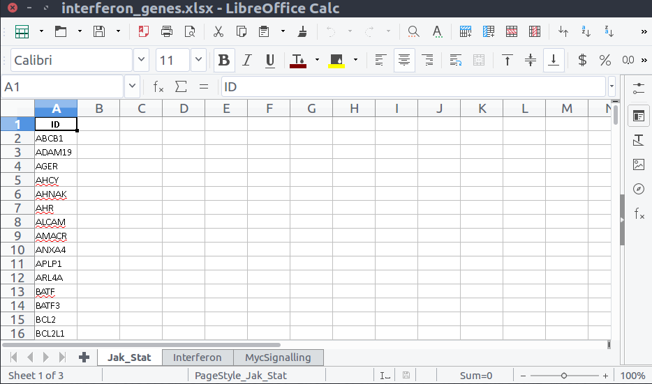

```{r,echo=FALSE}
## Set default options for the knitr RMD processing
knitr::opts_chunk$set(echo=FALSE,warning=FALSE,message=FALSE,fig.width=5,fig.height=5,cache=TRUE,autodep=TRUE, results="hide")
```

```{r libraries,cache=FALSE}
library(DESeq2)
library(tmod)
source("functions.R")
```

```{r}
set.seed(1234)
n <- 10
totN <- 50

ex1 <- rep(0, totN)
sel <- sort(sample(1:totN, n, prob=((totN:1)/totN)^7))
ex1[sel] <- 1
ex2 <- rep(0, totN)
ex2[ sample(1:totN, n) ] <- 1
```


```{r}
counts <- as.matrix(read.table("Data/covid_data/counts.tsv"))
annot  <- read.csv("Data/covid_data/annotation.all.csv")
covar  <- read.table("Data/covid_data/covariate_file.txt", sep="\t", header=T)

ds <- DESeqDataSetFromMatrix(countData=counts, 
  colData=covar, design=~ 0 + group)

ds <- DESeq(ds)
res <- results(ds, contrast=c("group", "A549.RSV", "A549.mock"))
res <- merge(annot, data.frame(res), by.x="PrimaryID", by.y=0)
```


```{r}
## making example data file with modules

library(msigdbr)
h <- as.data.frame(msigdbr(species="Homo sapiens", category="H"))
interf <- unique(h$human_gene_symbol[ h$gs_name %in% unique(h$gs_name)[ 26:27 ] ])
jakstat <- unique(h$human_gene_symbol[ h$gs_name %in% unique(h$gs_name)[ 23:24 ] ])
myc <- unique(h$human_gene_symbol[ h$gs_name %in% unique(h$gs_name)[ 32:33 ] ])
write_xlsx(lapply(list(Jak_Stat=jakstat, Interferon=interf, MycSignalling=myc), function(x) data.frame(ID=x)), path="custom_gs.xlsx")
```


# Creating your own gene sets

## Why use your own gene sets?

> * Testing a specific hypothesis
> * Your expert knowledge on the subject is better!
> * Avoiding the pitfall of multiple testing

## What do we need: tmod {.build}

 * A mapping between genes and gene sets

We need a **named list**. Names on that list should be identifiers of the gene
sets (preferably short). The list should contain **character vectors**. The
elements of these vectors should be the gene identifiers.

 * A data frame describing the gene sets 

`tmod` requires in addition a **data frame** which is the annotation 
of the gene sets. It must contain the columns `ID` and `Title`, but can
also contain other columns which are then used for subsetting.


## Getting the mapping

Say, we have a couple of gene sets saved in an XLSX file,
`"custom_gs.xlsx"` with multiple sheets.

```{r, results="markdown",cache=FALSE,out.width="70%"}

```

## Getting the mapping

```{r, echo=TRUE,results="markdown"}
library(readxl)
excel_sheets("custom_gs.xlsx")
cgs <- lapply(1:3, function(i) read_xlsx("custom_gs.xlsx", sheet=i))
```

## Getting the mapping

This list contains `tibbles` (a sort of a data frame) instead of character
vectors. To get what we need we need only the *first column* of each
spreadsheet!

```{r, echo=TRUE,results="markdown"}
cgs <- lapply(1:3, 
  function(i) read_xlsx("custom_gs.xlsx", sheet=i)[[1]])
names(cgs) <- excel_sheets("custom_gs.xlsx")
```

## Creating tmod database

`tmod` uses objects which contain both the data frame and the list.
`cluster profiler` simply uses the mapping (but its output is less
informative).

```{r tmod_object,results="markdown",echo=TRUE}
gs.df <- data.frame(ID=names(cgs), 
  Title=c("JAK / STAT pathway signalling", 
          "Interferon a+g signalling",
          "MYC targets"))
tcgs <- makeTmod(modules=gs.df, modules2genes=cgs)
tcgs
```


## Creating gene sets from MSigDB

How to create the `cgs`/`tcgs` from MSigDB.

```{r msigdb_tmod_object,results="markdown",echo=TRUE}
library(msigdbr)
h.df <- msigdbr("Homo sapiens", "H")
head(h.df)
```

## Creating gene sets from MSigDB

How to create the `cgs`/`tcgs` from MSigDB.

```{r msigdb_tmod_object2,results="markdown",echo=TRUE}
h.names <- unique(h.df$gs_name)
h.cgs <- lapply(h.names, function(n) 
  h.df$human_gene_symbol[ h.df$gs_name == n ])
h.names <- gsub("HALLMARK_", "", h.names)
names(h.cgs) <- h.names

htmod <- makeTmod(modules=data.frame(ID=h.names, Title=h.names), modules2genes=h.cgs)
htmod
```

## Using custom tmod modules


```{r tmod_custom_using,echo=TRUE,results="markdown"}
tmodCERNOtest(res$SYMBOL[ order(res$pvalue) ], mset=tcgs)
```

## For cluster profiler

Cluster profiler uses in its functions the option `TERM2GENE` which takes a
data frame with gene set names in one column and gene ids in the other.

It is really easy to convert a gene set list to a gene set data frame.

Of course, we can use the results directly.

```{r cp_object,results="markdown",echo=TRUE}
cgs.df <- Reduce(rbind,
  lapply(names(cgs), function(n) data.frame(ID=n, GENE=cgs[[n]])))
```


# More on tmod and cluster profiler

## Get the newest tmod!

Github is a development platform, extremely convenient for tracking the
versions of your project (not only for programming!).

`devtools` is a great R package for developing packages.
`devtools::install_github` allows installation of R packages directly from
github.

```{r, eval=FALSE,echo=TRUE}
install.packages("devtools")
devtools::install_github("https://github.com/january3/tmod")
```

## Important tmod functions

|category|function|description|
|--------|-------|-----------|
|testing|tmodCERNOtest|enrichment test on a ranked list|
|,,|tmodHGtest|hypergeometric test on foreground / background|
|,,|tmodPCA|combining PCA with gene set enrichments|
|,,|tmodUtest|enrichment test on a ranked list|
|,,|tmodZtest|enrichment test on a ranked list|
|,,|tmodPLAGEtest|enrichment test on an expression matrix|
|,,|tmodDecideTests|calculate how many genes from a given gene set are up- or down-regulated|
|visualization|tmodPanelPlot|heatmap for multiple contrasts containing loads of information|
|,,|evidencePlot|Detailed inspection of enrichment in a single gene set|
|,,|tmodTagcloud|Create a cloud of enrichment terms|
|,,|tmodPCA|combine PCA with gene set enrichments|
|,,|showGene|combined beeswarm+boxplot|
|import|tmodImportMSigDB|Read the XML file from MSigDB|
|tools|getModuleMembers|return the vector with gene IDs belonging to a gene set|


## Using cluster profiler

|function         |test           |database             |
|------------|---------|---------------|
|enricher    |HG | generic / custom|
|enrichDO|HG|disease ontology|
|enrichNCG|HG|Network of Cancer Gene|
|enrichDGN|HG|Disease-gene associations from DisGeNET|
|enrichGO|HG|Gene ontology|
|enrichKEGG|HG|KEGG database|
|enrichMKEGG|HG|KEGG Module database|
|GSEA|GSEA|generic / custom|
|gseDO|HG|disease ontology|
|gseNCG|HG|Network of Cancer Gene|
|gseDGN|HG|Disease-gene associations from DisGeNET|
|gseGO|HG|Gene ontology|
|gseKEGG|HG|KEGG database|
|gseMKEGG|HG|KEGG Module database|


## Using cluster profiler HG

Input:

 * `gene`: foreground set
 * `universe`: all genes
 * `TERM2GENE`: data frame mapping gene sets to genes

```{r cp_hg,echo=TRUE,results="markdown"}
sign  <- !is.na(res$padj) & res$padj < .01 & abs(res$log2FoldChange) > 1
fg <- res$SYMBOL[sign]
res.cphg <- enricher(fg, universe=res$SYMBOL, TERM2GENE=cgs.df)
head(res.cphg)[,1:5]
```

## Using cluster profiler GSEA

Input: 

 * decreasingly ordered numerical vector; names are the IDs of the genes
 * data frame assigning gene set IDs to genes

```{r cp,echo=TRUE,results="markdown"}
vec <- nrow(res):1
names(vec) <- res$SYMBOL[ order(res$pvalue) ]
res.cp <- GSEA(vec, TERM2GENE=cgs.df)
head(res.cp)[, 1:10]
```


## Cluster profiler GSEA vs tmodCERNOtest


```{r tmodvsgsea,echo=TRUE}
res.tmod.cerno.full <- tmodCERNOtest(res$SYMBOL[ order(res$pvalue) ],
  mset=htmod, qval=Inf, order.by="n")
res.cp <- GSEA(vec, TERM2GENE=h[ , c("gs_name", "human_gene_symbol") ],
  pvalueCutoff=Inf, nPerm=1e5)
res.cp <- as.data.frame(res.cp)[ , -ncol(res.cp) ]
res.cp$ID <- gsub("HALLMARK_", "", res.cp$ID)
res.cp <- res.cp[ match(res.tmod.cerno.full$ID, res.cp$ID), ]
```

## Cluster profiler GSEA vs tmodCERNOtest

```{r tmodvsgsea2,echo=FALSE}
par(bty="n")
plot(res.cp$qvalues, res.tmod.cerno.full$adj.P.Val, log="xy", xlab="cluster profiler", ylab="CERNO")
abline(0,1)
```


